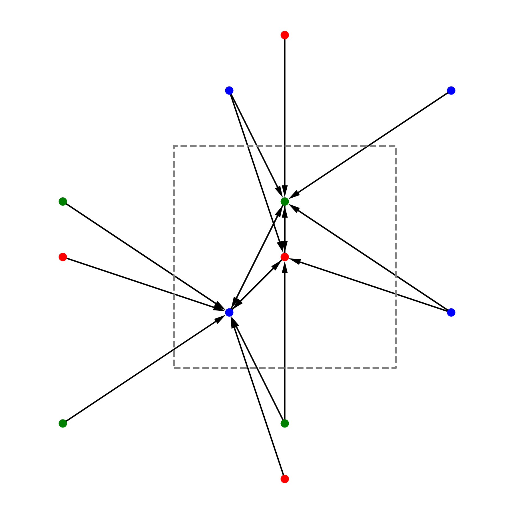

Tutorial: learn crystal energies with Nequip
============================================

.. image:: mp-169.png

The goal of this tutorial is to show how to use Nequip to train a neural network to predict the energy of crystals.

.. |check| raw:: html

    <input checked=""  type="checkbox">

.. |uncheck| raw:: html

    <input type="checkbox">

What this tutorial will cover (and not cover)
---------------------------------------------

| |check| Create a Nequip model
| |check| Create a simple dataset
| |check| Train the model to predict the energy
| |check| Introduction to ``jraph`` to deal with graphs
| |check| Introduction to ``flax`` to create parameterized models
| |check| Introduction to ``optax`` to optimize the parameters
| |uncheck| Train to predict the forces (by differentiating the energy)
| |uncheck| Having more than one batch and pad them with ``jraph.pad_with_graphs``
| |uncheck| Add support for different atom types (by embedding them)
| |uncheck| Test the model on unseen crystals

Import the libraries
--------------------

For this tutorial we will need the following libraries:

.. jupyter-execute::

    import flax  # neural network modules for jax
    import jax
    import jax.numpy as jnp
    import jraph  # graph neural networks in jax
    import matplotlib.pyplot as plt
    import numpy as np
    import optax  # optimizers for jax
    from matscipy.neighbours import neighbour_list  # fast neighbour list implementation

    from nequip_jax import NEQUIPLayerFlax  # e3nn implementation of NEQUIP
    import e3nn_jax as e3nn

If you want to use a GPU, checkout the `jax installation guide <https://github.com/google/jax#installation>`_.

Here are the ``pip`` commands to install everything::

    pip install -U pip
    pip install -U "jax[cpu]"

    pip install -U flax jraph optax
    pip install -U matscipy
    pip install -U matplotlib
    pip install -U e3nn_jax

    pip install git+https://github.com/mariogeiger/nequip-jax.git

Dataset
-------

Let's create a **very** simple dataset of few crystals from `materials project <https://materialsproject.org>`_ made only of carbon atoms.
Materials project provides a *Predicted Formation Energy* for each crystal, and we will use this as our target.

 * `mp-47 <https://materialsproject.org/materials/mp-47>`_
 * `mp-48 <https://materialsproject.org/materials/mp-48>`_
 * `mp-66 <https://materialsproject.org/materials/mp-66>`_
 * `mp-169 <https://materialsproject.org/materials/mp-169>`_

To compute the graph connectivity we use `matscipy <https://github.com/libAtoms/matscipy>`_
library which has a very fast neighbour list implementation.

.. jupyter-execute::

    def compute_edges(positions, cell, cutoff):
        """Compute edges of the graph from positions and cell."""
        receivers, senders, senders_unit_shifts = neighbour_list(
            quantities="ijS",
            pbc=np.array([True, True, True]),
            cell=cell,
            positions=positions,
            cutoff=cutoff,
        )

        num_edges = senders.shape[0]
        assert senders.shape == (num_edges,)
        assert receivers.shape == (num_edges,)
        assert senders_unit_shifts.shape == (num_edges, 3)
        return senders, receivers, senders_unit_shifts

This image shows the edges created by ``matscipy.neighbours.neighbour_list`` for an example crystal in 2D. Note that all the edges point (``receivers`` side) to an atom in the central cell.

Then we use `jraph <https://github.com/deepmind/jraph>`_ to create a graph objects and (later) batch them together. ``jraph`` is a library for graph neural networks in jax developed by DeepMind.
The following function ``create_graph`` creates a graph object from the given positions, cell and energy of the crystal.
Each crystal is stored in a ``jraph.GraphsTuple``, which is the cornerstone datatype of the ``jraph`` library. It is a named tuple that contains all the information about a graph. The documentation of ``jraph.GraphsTuple`` can be found `here <https://jraph.readthedocs.io/en/latest/api.html#graphstuple>`_.

.. jupyter-execute::

    def create_graph(positions, cell, energy, cutoff):
        """Create a graph from positions, cell, and energy."""
        senders, receivers, senders_unit_shifts = compute_edges(positions, cell, cutoff)

        # In a jraph.GraphsTuple object, nodes, edges, and globals can be any
        # pytree. In this case, we use arrays for nodes and edges, and a dict for
        # globals.
        # What matters is that the first dimension of each array is the number of
        # nodes, edges, or graphs in the batch.

        graph = jraph.GraphsTuple(
            # There is one position per node, so we store them in the nodes field.
            nodes=positions,
            # There is one unit shift per edge, so we store them in the edges field.
            edges=senders_unit_shifts,
            # There is one energy and one cell per graph, so we store them in the
            # globals field.
            globals=dict(energies=np.array([energy]), cells=cell[None, :, :]),
            # The rest of the fields describe the connectivity and size of the graph.
            senders=senders,
            receivers=receivers,
            n_node=np.array([positions.shape[0]]),
            n_edge=np.array([senders.shape[0]]),
        )
        return graph

We need to specify the cutoff for the neighbour list. This is the distance up to which we consider two atoms to be connected. All the distances here are in angstroms.

.. jupyter-execute::

    cutoff = 2.0  # in angstroms

Now we can create the graphs for the crystals. The values of the positions, cell and energy are taken from the materials project website.

.. jupyter-execute::

    mp47 = create_graph(
        positions=np.array(
            [
                [-0.0, 1.44528, 0.26183],
                [1.25165, 0.72264, 2.34632],
                [1.25165, 0.72264, 3.90714],
                [-0.0, 1.44528, 1.82265],
            ]
        ),
        cell=np.array([[2.5033, 0.0, 0.0], [-1.25165, 2.16792, 0.0], [0.0, 0.0, 4.16897]]),
        energy=0.163,  # eV/atom
        cutoff=cutoff,
    )
    print(f"mp47 has {mp47.n_node} nodes and {mp47.n_edge} edges")

    mp48 = create_graph(
        positions=np.array(
            [
                [0.0, 0.0, 1.95077],
                [0.0, 0.0, 5.8523],
                [-0.0, 1.42449, 1.95077],
                [1.23365, 0.71225, 5.8523],
            ]
        ),
        cell=np.array([[2.46729, 0.0, 0.0], [-1.23365, 2.13674, 0.0], [0.0, 0.0, 7.80307]]),
        energy=0.008,  # eV/atom
        cutoff=cutoff,
    )
    print(f"mp48 has {mp48.n_node} nodes and {mp48.n_edge} edges")

    mp66 = create_graph(
        positions=np.array(
            [
                [0.0, 0.0, 1.78037],
                [0.89019, 0.89019, 2.67056],
                [0.0, 1.78037, 0.0],
                [0.89019, 2.67056, 0.89019],
                [1.78037, 0.0, 0.0],
                [2.67056, 0.89019, 0.89019],
                [1.78037, 1.78037, 1.78037],
                [2.67056, 2.67056, 2.67056],
            ]
        ),
        cell=np.array([[3.56075, 0.0, 0.0], [0.0, 3.56075, 0.0], [0.0, 0.0, 3.56075]]),
        energy=0.138,  # eV/atom
        cutoff=cutoff,
    )
    print(f"mp66 has {mp66.n_node} nodes and {mp66.n_edge} edges")

    mp169 = create_graph(
        positions=np.array(
            [
                [-0.66993, 0.0, 3.5025],
                [3.5455, 0.0, 0.00033],
                [1.45739, 1.22828, 3.5025],
                [1.41818, 1.22828, 0.00033],
            ]
        ),
        cell=np.array([[4.25464, 0.0, 0.0], [0.0, 2.45656, 0.0], [-1.37907, 0.0, 3.50283]]),
        energy=0.003,  # eV/atom
        cutoff=cutoff,
    )
    print(f"mp169 has {mp169.n_node} nodes and {mp169.n_edge} edges")

Now that we have ``mp47``, ``mp48``, ``mp66`` and ``mp169`` as graphs, we can batch them together to create a dataset. `Batching <https://jraph.readthedocs.io/en/latest/api.html#batching-padding-utilities>`_ is an important concept concept in ``jraph``.

.. jupyter-execute::

    dataset = jraph.batch([mp47, mp48, mp66, mp169])
    print(f"dataset has {dataset.n_node} nodes and {dataset.n_edge} edges")

    print(jax.tree_util.tree_map(jnp.shape, dataset))

Model
-----

Before defining the model, we need to make sure we properly take into account the periodic boundary conditions of the crystals. The model will need to know the relative vectors between the atoms in the crystal. We know the positions of the atoms inside the unit cell, but we need to know the relative vectors between the atoms even if they don't belong to the same cell.

.. jupyter-execute::

    def get_relative_vectors(senders, receivers, n_edge, positions, cells, shifts):
        """Compute the relative vectors between the senders and receivers."""
        num_nodes = positions.shape[0]
        num_edges = senders.shape[0]
        num_graphs = n_edge.shape[0]

        assert positions.shape == (num_nodes, 3)
        assert cells.shape == (num_graphs, 3, 3)
        assert senders.shape == (num_edges,)
        assert receivers.shape == (num_edges,)
        assert shifts.shape == (num_edges, 3)

        # We need to repeat the cells for each edge.
        cells = jnp.repeat(cells, n_edge, axis=0, total_repeat_length=num_edges)

        # Compute the two ends of each edge.
        positions_receivers = positions[receivers]
        positions_senders = positions[senders] + jnp.einsum("ei,eij->ej", shifts, cells)

        vectors = e3nn.IrrepsArray("1o", positions_receivers - positions_senders)
        return vectors

Now we define the model layer based on `Nequip architecture <https://arxiv.org/pdf/2101.03164.pdf>`_.
For that we will use the implementation available at `github.com/mariogeiger/nequip-jax <https://github.com/mariogeiger/nequip-jax>`_.
You can install it with pip using the command ``pip install git+https://github.com/mariogeiger/nequip-jax.git``.

.. jupyter-execute::

    class Model(flax.linen.Module):
        @flax.linen.compact
        def __call__(self, graphs):
            num_nodes = graphs.nodes.shape[0]
            senders = graphs.senders
            receivers = graphs.receivers

            vectors = get_relative_vectors(
                senders,
                receivers,
                graphs.n_edge,
                positions=graphs.nodes,
                cells=graphs.globals["cells"],
                shifts=graphs.edges,
            )

            # We divide the relative vectors by the cutoff
            # because NEQUIPLayerFlax assumes a cutoff of 1.0
            vectors = vectors / cutoff

            # Create dummy features (just ones 0e) and species (all carbon atoms)
            features = e3nn.IrrepsArray("0e", jnp.ones((num_nodes, 1)))
            species = jnp.zeros((num_nodes,), dtype=jnp.int32)

            # Apply 3 Nequip layers with different internal representations
            for irreps in [
                "32x0e + 32x0o + 8x1e + 8x1o + 8x2e + 8x2o",
                "32x0e + 32x0o + 8x1e + 8x1o + 8x2e + 8x2o",
                "32x0e",
            ]:
                layer = NEQUIPLayerFlax(
                    avg_num_neighbors=4.0,  # average number of neighbors to normalize by
                    output_irreps=irreps,
                )
                features = layer(vectors, features, species, senders, receivers)

            features = e3nn.flax.Linear("0e", name="output")(features)

            # Average the features (energy prediction) over the nodes of each graph
            return e3nn.scatter_sum(features, nel=graphs.n_node) / graphs.n_node[:, None]

Training
--------

Now that we defined the model, we need to define the loss function to train it.
For this example we will use the mean squared error.

.. jupyter-execute::

    def loss_fn(preds, targets):
        assert preds.shape == targets.shape
        return jnp.mean(jnp.square(preds - targets))

Now let's use the magic of ``flax`` to initialize the model and use the magic of ``optax`` to define the optimizer and initialize it as well.
As optimizer we will use Adam. This optimizer needs to keep track of the average of the gradients and the average of the squared gradients. This is why it has a state. The state is initialized with ``opt.init``.

.. jupyter-execute::

    random_key = jax.random.PRNGKey(0)  # change it to get different initializations

    # Initialize the model
    f = Model()
    w = jax.jit(f.init)(random_key, dataset)

    # Initialize the optimizer
    opt = optax.adam(1e-4)
    opt_state = opt.init(w)

Let's define the training step. We will use ``jax.jit`` to compile the function and make it faster.
This function takes as input the model parameters, the optimizer state and the dataset and returns the updated optimizer state, the updated model parameters and the loss.

.. jupyter-execute::

    @jax.jit
    def train_step(opt_state, w, dataset):
        """Perform a single training step."""
        num_graphs = dataset.n_node.shape[0]

        # Compute the loss as a function of the parameters
        def fun(w):
            preds = f.apply(w, dataset).array.squeeze(1)
            targets = dataset.globals["energies"]

            assert preds.shape == (num_graphs,)
            assert targets.shape == (num_graphs,)
            return loss_fn(preds, targets)

        # And take its gradient
        loss, grad = jax.value_and_grad(fun)(w)

        # Update the parameters and the optimizer state
        updates, opt_state = opt.update(grad, opt_state)
        w = optax.apply_updates(w, updates)

        return opt_state, w, loss

Finally, let's train the model for 1000 iterations.

.. jupyter-execute::

    losses = []
    for _ in range(1000):
        opt_state, w, loss = train_step(opt_state, w, dataset)
        losses.append(loss)

Did it work?

.. jupyter-execute::

    plt.plot(losses)
    plt.xscale("log")
    plt.yscale("log")
    plt.xlabel("Iteration")
    plt.ylabel("Loss")
