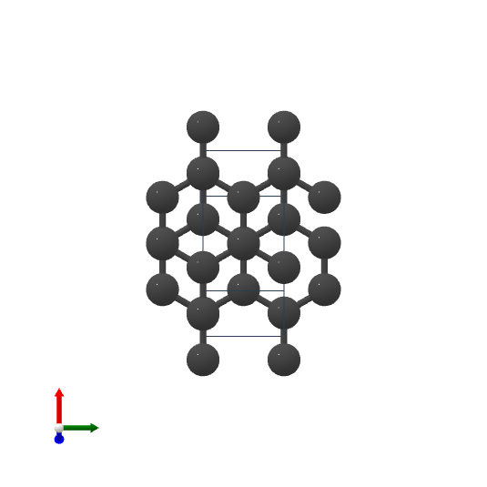

Tutorial: learn crystal energies with Nequip
============================================

**Task**: regression of the energy of crystals.

.. |check| raw:: html

    <input checked=""  type="checkbox">

.. |uncheck| raw:: html

    <input type="checkbox">

What this tutorial will cover:

| |check| Create a Nequip model
| |check| Create a simple dataset
| |check| Train the model to predict the energy
| |uncheck| Train to predict the forces
| |uncheck| Having more than one batch and pad them with ``jraph.pad_with_graphs``
| |uncheck| Add support for different atom types
| |uncheck| Test the model on unseen crystals

.. jupyter-execute::

    import flax  # neural network modules for jax
    import jax
    import jax.numpy as jnp
    import jraph  # graph neural networks in jax
    import matplotlib.pyplot as plt
    import numpy as np
    import optax  # optimizers for jax
    from matscipy.neighbours import neighbour_list  # fast neighbour list implementation

    import e3nn_jax as e3nn

Let's create a **very** simple dataset of few crystals from `materials project <https://materialsproject.org>`_ made only of carbon atoms.
Materials project provides a *Predicted Formation Energy* for each crystal, and we will use this as our target.

 * `mp-47 <https://materialsproject.org/materials/mp-47>`_
 * `mp-48 <https://materialsproject.org/materials/mp-48>`_
 * `mp-66 <https://materialsproject.org/materials/mp-66>`_
 * `mp-169 <https://materialsproject.org/materials/mp-169>`_

To compute the graph connectivity we use `matscipy <https://github.com/libAtoms/matscipy>`_
library which has a very fast neighbour list implementation.
Then we use `jraph <https://github.com/deepmind/jraph>`_ to create a graph objects and batch them together. ``jraph`` is a library for graph neural networks in jax developed by DeepMind.

.. jupyter-execute::

    def create_graph(positions, cell, energy, cutoff):
        # Compute the neighbour list up to the cutoff
        receivers, senders, senders_unit_shifts = neighbour_list(
            quantities="ijS",
            pbc=np.array([True, True, True]),
            cell=cell,
            positions=positions,
            cutoff=cutoff,
        )
        num_edges = senders.shape[0]
        assert senders.shape == (num_edges,)
        assert receivers.shape == (num_edges,)
        assert senders_unit_shifts.shape == (num_edges, 3)

        # In a jraph.GraphsTuple object, nodes, edges, and globals can be any
        # pytree. In this case, we use arrays for nodes and edges, and a dict for
        # globals.
        # What matters is that the first dimension of each array is the number of
        # nodes, edges, or graphs in the batch.
        graph = jraph.GraphsTuple(
            # There is one position per node, so we store them in the nodes field.
            nodes=positions,
            # There is one unit shift per edge, so we store them in the edges field.
            edges=senders_unit_shifts,
            # There is one energy and one cell per graph, so we store them in the
            # globals field.
            globals=dict(energies=np.array([energy]), cells=cell[None, :, :]),
            # The rest of the fields describe the connectivity and size of the graph.
            senders=senders,
            receivers=receivers,
            n_node=np.array([positions.shape[0]]),
            n_edge=np.array([senders.shape[0]]),
        )
        return graph

The function ``create_graph`` creates a graph object from the positions, cell and energy of the crystal.
``jraph.GraphsTuple`` is the cornerstone of ``jraph`` library. It is a named tuple that contains all the information about a graph. The documentation of ``jraph.GraphsTuple`` can be found `here <https://jraph.readthedocs.io/en/latest/api.html#graphstuple>`_.

.. jupyter-execute::

    cutoff = 2.0  # in angstroms

.. jupyter-execute::

    mp47 = create_graph(
        positions=np.array(
            [
                [-0.0, 1.44528, 0.26183],
                [1.25165, 0.72264, 2.34632],
                [1.25165, 0.72264, 3.90714],
                [-0.0, 1.44528, 1.82265],
            ]
        ),
        cell=np.array([[2.5033, 0.0, 0.0], [-1.25165, 2.16792, 0.0], [0.0, 0.0, 4.16897]]),
        energy=0.163,  # eV/atom
        cutoff=cutoff,
    )
    print(f"mp47 has {mp47.n_node} nodes and {mp47.n_edge} edges")

    mp48 = create_graph(
        positions=np.array(
            [
                [0.0, 0.0, 1.95077],
                [0.0, 0.0, 5.8523],
                [-0.0, 1.42449, 1.95077],
                [1.23365, 0.71225, 5.8523],
            ]
        ),
        cell=np.array([[2.46729, 0.0, 0.0], [-1.23365, 2.13674, 0.0], [0.0, 0.0, 7.80307]]),
        energy=0.008,  # eV/atom
        cutoff=cutoff,
    )
    print(f"mp48 has {mp48.n_node} nodes and {mp48.n_edge} edges")

    mp66 = create_graph(
        positions=np.array(
            [
                [0.0, 0.0, 1.78037],
                [0.89019, 0.89019, 2.67056],
                [0.0, 1.78037, 0.0],
                [0.89019, 2.67056, 0.89019],
                [1.78037, 0.0, 0.0],
                [2.67056, 0.89019, 0.89019],
                [1.78037, 1.78037, 1.78037],
                [2.67056, 2.67056, 2.67056],
            ]
        ),
        cell=np.array([[3.56075, 0.0, 0.0], [0.0, 3.56075, 0.0], [0.0, 0.0, 3.56075]]),
        energy=0.138,  # eV/atom
        cutoff=cutoff,
    )
    print(f"mp66 has {mp66.n_node} nodes and {mp66.n_edge} edges")

    mp169 = create_graph(
        positions=np.array(
            [
                [-0.66993, 0.0, 3.5025],
                [3.5455, 0.0, 0.00033],
                [1.45739, 1.22828, 3.5025],
                [1.41818, 1.22828, 0.00033],
            ]
        ),
        cell=np.array([[4.25464, 0.0, 0.0], [0.0, 2.45656, 0.0], [-1.37907, 0.0, 3.50283]]),
        energy=0.003,  # eV/atom
        cutoff=cutoff,
    )
    print(f"mp169 has {mp169.n_node} nodes and {mp169.n_edge} edges")

    dataset = jraph.batch([mp47, mp48, mp66, mp169])
    print(f"dataset has {dataset.n_node} nodes and {dataset.n_edge} edges")

    print(jax.tree_util.tree_map(jnp.shape, dataset))

Now we define the model layer based on `Nequip architecture <https://arxiv.org/pdf/2101.03164.pdf>`_.
For that we will use the implementation available at `github.com/mariogeiger/nequip-jax <https://github.com/mariogeiger/nequip-jax>`_.
You can install it with pip using the command ``pip install git+git://github.com/mariogeiger/nequip-jax.git``.

.. jupyter-execute::

    from nequip_jax import NEQUIPLayerFlax

    class Model(flax.linen.Module):
        @flax.linen.compact
        def __call__(self, graphs):
            # Extract the informations from the jraph.GraphsTuple object
            senders = graphs.senders
            receivers = graphs.receivers
            num_nodes = graphs.nodes.shape[0]
            num_edges = senders.shape[0]

            # Get the atomic positions and the cell and compute the relative vectors
            positions = graphs.nodes
            cells = graphs.globals["cells"]

            # We need the unit shifts to know if the edge is across two cells
            shifts = graphs.edges
            cells = jnp.repeat(cells, graphs.n_edge, axis=0, total_repeat_length=num_edges)

            positions_receivers = positions[receivers]
            positions_senders = positions[senders] + jnp.einsum("ei,eij->ej", shifts, cells)

            # We divide the relative vectors by the cutoff
            # because NEQUIPLayerFlax assumes a cutoff of 1.0
            vectors = e3nn.IrrepsArray("1o", positions_receivers - positions_senders) / cutoff

            # Create dummy features (just ones 0e) and species (all carbon atoms)
            features = e3nn.IrrepsArray("0e", jnp.ones((len(positions), 1)))
            species = jnp.zeros((len(positions),), dtype=jnp.int32)
            avg_num_neighbors = 4.0  # This is used to rescale the sum of the message passing

            # Apply 3 Nequip layers with different internal representations
            for irreps in [
                "32x0e + 32x0o + 8x1e + 8x1o + 8x2e + 8x2o",
                "32x0e + 32x0o + 8x1e + 8x1o + 8x2e + 8x2o",
                "32x0e",
            ]:
                layer = NEQUIPLayerFlax(avg_num_neighbors=avg_num_neighbors, output_irreps=irreps)
                features = layer(vectors, features, species, senders, receivers)

            features = e3nn.flax.Linear("0e", name="output")(features)

            return e3nn.scatter_sum(features, nel=graphs.n_node) / graphs.n_node[:, None]

Now that we defined the model, we need to define the loss function.
For this example we will use the mean squared error as loss function.

.. jupyter-execute::

    def loss_fn(preds, targets):
        assert preds.shape == targets.shape
        return jnp.mean(jnp.square(preds - targets))

Now let's use the magic of ``flax`` to initialize the model and use the magic of ``optax`` to define the optimizer and initialize it as well.

.. jupyter-execute::

    f = Model()
    w = jax.jit(f.init)(jax.random.PRNGKey(1), dataset)
    opt = optax.adam(1e-4)
    state = opt.init(w)

Let's define the training step. We will use ``jax.jit`` to compile the function and make it faster.
This function takes as input the model parameters, the optimizer state and the dataset and returns the updated optimizer state, the updated model parameters and the loss.

.. jupyter-execute::

    @jax.jit
    def train_step(state, w, dataset):
        num_graphs = dataset.n_node.shape[0]

        # Compute the loss as a function of the parameters
        def fun(w):
            preds = f.apply(w, dataset).array.squeeze(1)
            targets = dataset.globals["energies"]

            assert preds.shape == (num_graphs,)
            assert targets.shape == (num_graphs,)
            return loss_fn(preds, targets)

        # And take its gradient
        loss, grad = jax.value_and_grad(fun)(w)

        # Update the parameters and the optimizer state
        updates, state = opt.update(grad, state)
        w = optax.apply_updates(w, updates)

        return state, w, loss

Finally, let's train the model for 1000 iterations.

.. jupyter-execute::

    losses = []
    for _ in range(1000):
        state, w, loss = train_step(state, w, dataset)
        losses.append(loss)

    plt.plot(losses)
    plt.xscale("log")
    plt.yscale("log")
    plt.xlabel("Iteration")
    plt.ylabel("Loss")
